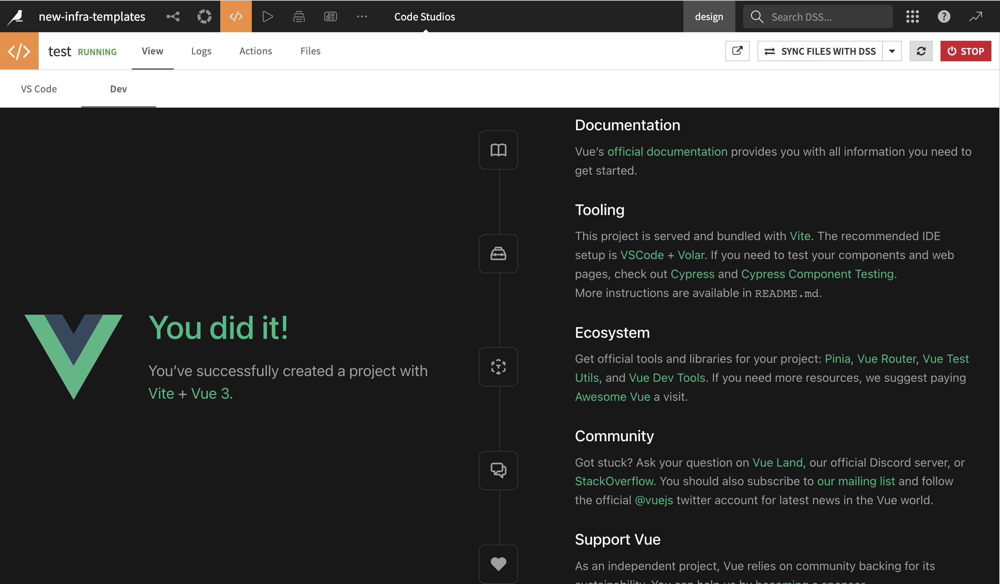

# Quickstart with Angular & Vue Templates

```{admonition} Pre-requisites
:class: important

* Basic understanding of HTML, JavaScript, and either Angular or Vue for frontend development.
* Some experience with Python for backend operations.
* [Code Studio Template](../template/index) already configured on your Dataiku instance.

```

In this guide, learn how to rapidly initiate a Vue or Angular web application using pre-configured templates. These templates streamline your workflow by auto-configuring a Node server to host your Code Studio browser path, while also routing API requests to the exposed Flask backend.

These templates are also designed for smooth [deployment ](../deployment/index) as a standard Dataiku web application.

## Quick Project Setup with Cookiecutter

:::{topic} Note

- Cookiecutter serves as a command-line tool for swift project generation from templates. In this scenario, the Cookiecutter Python code environment, as defined in the Code Studio template, will be employed.
- All web application projects should be initiated inside the project-lib-versioned/webapps directory. Doing so enables seamless synchronization of your source code and build files with the Dataiku project library, thereby simplifying the deployment process.
  :::

### Activating the Cookiecutter Environment

To activate your Cookiecutter environment in the Visual Studio Code (VS Code) UI panel, run the command bellow:

```
source /opt/dataiku/python-code-envs/cookiecutter/bin/activate
```

:::{topic} Note

- The default path for code environments specified in the Code Studio template is  **/opt/dataiku/python-code-envs/**.  If you've customized this location in the template settings, make sure to update the path in the command accordingly.
  :::

### Generating a New Web Application

- Navigate to the following directory:

  ```
  mkdir ~/workspace/project-lib-versioned/webapps && cd ~/workspace/project-lib-versioned/webapps
  ```

- Execute the following command to instantiate a new project template with Cookiecutter:

  ```
  cookiecutter gh:dataiku/solutions-contrib --checkout=feature/packaging
  ```

- Cookiecutter will then prompt you to select a template:

  ```
  [1/1] Select template
      1 - Angular (./bs-templates/angular)
      2 - BS (./bs-templates/bs)
      3 - Vue (./bs-templates/vue)
      Choose from [1/2/3] (1):
  ```

  - Select the desired template by entering the corresponding number (1, 2, or 3).

- After template selection, you'll be prompted to enter specific project parameters:

  ```
  [1/6] Choose your (Angular / Vue / Bs) project name (Angular Project): tutorial
  [2/6] version (0.0.1):
  [3/6] Choose your client serve port (default 4200) (4200):
  [4/6] Choose your flask backend port (default 5000) (5000):
  [5/6] dss_instance (default):
  [6/6] dku_project ():
  ```

  - "Project Name": This is the name for your Angular, Vue, or BS project. Though the example uses "tutorial," you're free to choose any name.
  - "Version" This is where you specify your project's version.
  - "Client serve port" The port on which your frontend (e.g., Angular) will run. Default is 4200.
  - "Flask backend port" The port your Flask backend will operate on. Default is 5000.
  - "DSS Instance and DKU Project": While operating within Dataiku Code Studio, these fields are generally optional. You can safely leave them blank, unless you're configuring an external development environment that necessitates their input.

- After entering these details, a new project folder will be generated in the **project-lib-versioned/webapps** directory

By adhering to these steps, you'll successfully set up a new web application, ready for further development and deployment.

## Vue Starter Template

The Vue starter template is inspired by the resulting template from [create-vue](https://github.com/vuejs/create-vue). It features a pre-configured [Vite server](https://vitejs.dev/) aligned with the correct Code Studio base path. Additionally, an Axios HTTP client is set up to route requests to the designated Flask backend service.

### Launching the Frontend

- Navigate to your project's directory by replacing **\_\_PROJECT_NAME\_\_** with your project folder name:

  ```
  cd ~/workspace/project-lib-versioned/webapps/__PROJECT_NAME__
  ```

- Install the required dependencies:

  ```
  yarn install
  ```

  :::{topic} Note
  The Code Studio template comes pre-configured with npm, yarn, and pnpm. You can use any of these package managers to install dependencies. For instance, you can replace **yarn install** with **npm install** or **pnpm install** based on your preference.
  :::

- Run the frontend server

  ```
  yarn run dev
  ```

- You can now preview the web application in the Dev panel of the Code Studio.



### Initiating the Backend

- Activate your backend code environment

  ```
  source /opt/dataiku/python-code-envs/infra37/bin/activate
  ```

  :::{topic} Note
  If you've imported the Code Studio template, an **infra37** code environment with the essential requirements for launching the included Flask server will be available. This environment necessitates **python >= 3.6** or higher and incorporates the following packages:

  ```
  Flask>=0.9
  git+https://github.com/dataiku/solutions-contrib.git@main#egg=webaiku&subdirectory=bs-infra
  python-dotenv>=0.19.0
  dataiku-api-client
  ```

  :::

- Navigate back to your project directory (again, replace **\_\_PROJECT_NAME\_\_** with your specific folder name):

  ```
  cd ~/workspace/project-lib-versioned/webapps/__PROJECT_NAME__
  ```

- Execute the following command to launch the backend:

  ```
  python -m backend.wsgi
  ```

By following these steps, you'll successfully initiate both the frontend and backend of your Vue application within Dataiku's Code Studio environment.


## Angular Starter Template


### Launching the Frontend

- Navigate to your project's directory by replacing **\_\_PROJECT_NAME\_\_** with your project folder name:

  ```
  cd ~/workspace/project-lib-versioned/webapps/__PROJECT_NAME__
  ```

- Install required dependencies:

  ```
  npm install
  ```

  :::{topic} Note
  The Code Studio template comes pre-configured with npm, yarn, and pnpm. You can use any of these package managers to install dependencies. For instance, you can replace **yarn install** with **npm install** or **pnpm install** based on your preference.
  :::

- Run the frontend server

  ```
  npm run start
  ```

- You can now preview the web application in the Dev panel of the Code Studio.


### Initiating the Backend

- Activate the backend code environment

  ```
  source /opt/dataiku/python-code-envs/infra37/bin/activate
  ```

  :::{topic} Note
  If you've imported the Code Studio template, an **infra37** code environment with the essential requirements for launching the included Flask server will be available. This environment necessitates **python >= 3.6** or higher and incorporates the following packages:

  ```
  Flask>=0.9
  git+https://github.com/dataiku/solutions-contrib.git@main#egg=webaiku&subdirectory=bs-infra
  python-dotenv>=0.19.0
  dataiku-api-client
  ```

  :::

- Navigate back to your project directory (again, replace **\_\_PROJECT_NAME\_\_** with your specific folder name):

  ```
  cd ~/workspace/project-lib-versioned/webapps/__PROJECT_NAME__
  ```

- Execute the following command to launch the backend:

  ```
  python -m backend.wsgi
  ```

By following these steps, you'll successfully initiate both the frontend and backend of your Vue application within Dataiku's Code Studio environment.