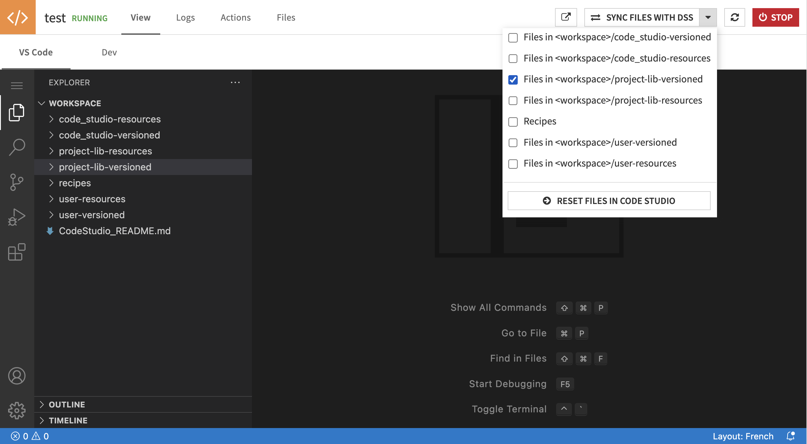
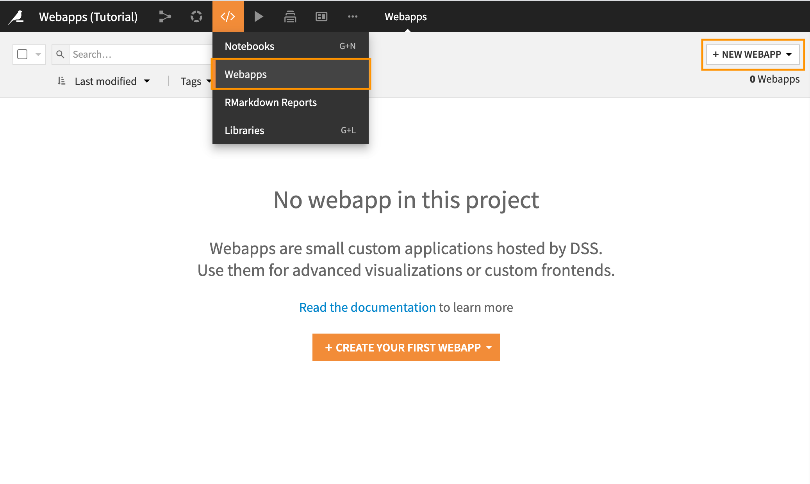

# Deploy your web application

In this section, we guide you through the process of deploying a web application created within the Code Studio, transforming deploying it as a standard Dataiku web application.

```{tip} Updating an Existing Deployment

If you've previously deployed a web application and wish to update it, you can simply [Build the webapp](#step-1-building-the-application), [Synchronize the files](#step-2-synchronize-files-with-dataiku-instance) and restart you web application backend
```

(step-1-building-the-application)=
## Step 1: Building the application

Initiate the build process for your web application within Code Studio by following these steps:

- Open your terminal and navigate to the project folder. Replace  **\_\_PROJECT_NAME\_\_**  with the actual name of your project directory:

  ```
  cd ~/workspace/project-lib-versioned/webapps/__PROJECT_NAME__
  ```

- Execute the appropriate build command based on your choice of package manager:

  ```
  yarn run build
  ```

  :::{topic} Note
  npm, yarn, and pnpm are pre-installed in the Code Studio template. Feel free to switch out **yarn run build** with **npm run build** or **pnpm run build**, depending on your preferred package manager.
  :::

- Upon successful compilation, the built files will be located in the **dist** folder under the directory path **/workspace/project-lib-versioned/webapps/**PROJECT_NAME**/dist**

(step-2-synchronize-files-with-dataiku-instance)=
## Step 2: Synchronize Files with Dataiku instance

- To ensure that your web application files are accessible within the Dataiku DSS environment, you'll need to synchronize the contents of your  <workspace>/project-lib-versioned folder with Dataiku



## Step 3: Include Webapps Folder in Project Python Path

Incorporating the **webapps** folder into your project's Python path enables the import of your custom Flask blueprints and Python modules.

- Navigate to **Libraries** via the top menu bar.
- Edit the  **external-libraries.json** file to include **webapps** in the "pythonPath":

  ```
  {
      "gitReferences": {},
      "pythonPath": [
          "python",
          "webapps"
      ],
      "rsrcPath": [
          "R"
      ],
      "importLibrariesFromProjects": []
  }
  ```

By doing this, you make it possible to seamlessly integrate your custom Flask functionalities and Python modules into your Dataiku project.

## Step 4: Initialize a New Standard Dataiku Web Application

- Navigate to </> -> Webapps through the top menu bar.

- Click on _+ New Webapp_ button located at the top right corner of the screen, then choose _Code Webapp > Standard_.



- Clear out the default code present in the  **CSS**, **HTML**, **JS** and **Python** tabs of your web application.

## Step 5: Configuring the Python Backend

- Open the Settings panel in the web application you've just created. Here, select the appropriate code environment for your backend development.

  :::{topic} Note

  - Ensure that the Python version in your code environment is  **>=3.6** .
  - The code environment should at minimum meet the following requirements, in addition to any specific needs your backend might have:

  Flask>=0.9
  git+https://github.com/dataiku/solutions-contrib.git@main#egg=webaiku&subdirectory=bs-infra
  dataiku-api-client
  :::

- Populate the Python backend tab of your standard web application with the following code snippet. Make sure to replace {**\_\_YOUR_WEBAPPLICATION_FOLDER\_\_**} with your actual web application folder name:

  ```
  from flask import Flask
  from webaiku.extension import WEBAIKU
  from webapps.{__YOUR_WEBAPPLICATION_FOLDER__}.backend.fetch_api import fetch_api


  WEBAIKU(app, "webapps/{__YOUR_WEBAPPLICATION_FOLDER__}/dist")
  WEBAIKU.extend(app, [fetch_api])
  ```

  :::{topic} Note

  - The example code imports _fetch_api_, which is the default blueprint in the starter template. Feel free to import any other blueprints or packages you've added during development.
  - WEBAIKU s a wrapper around the Flask app. It extends the Flask app to serve your static files from the Flask server's backend address.
    :::

## Step 6: Initialize JavaScript

- In the JavaScript tab of your web application, paste the following code:

  ```
  const backendURL = dataiku.getWebAppBackendUrl('fetch/bs_init?URL='+getWebAppBackendUrl(''));
  window.onload = function() {
      var ifrm = document.createElement("iframe");
      ifrm.setAttribute("src", backendURL);
      ifrm.setAttribute("style", "position:fixed; top:0; left:0; bottom:0; right:0; width:100%; height:100%; border:none; margin:0; padding:0; overflow:hidden; z-index:999999;");
      document.body.appendChild(ifrm);
  }

  ```

  :::{topic} Note
  This JavaScript code dynamically generates a full-screen iframe upon the web page's complete loading. The iframe fetches its content from the Flask server backend using the URL specified in _backendURL_.
  :::

After inserting the provided Python and JavaScript code snippets, your web application is ready for viewing.


This concludes the JavaScript initialization step, and you should now have a fully functioning web application, developed using your preferred framework and deployed within Dataiku 

## Next steps

With your web application fully deployed, the next action you may take is to publish it on a [Dataiku Dashboard](https://doc.dataiku.com/dss/latest/dashboards/index.html).

Below are the complete versions of the code snippets used throughout this tutorial for easy reference:

```{dropdown} [JS Code](./assets/code.js)

:::{literalinclude} assets/code.js
:language: javascript
:::
```

```{dropdown} [Python Code](./assets/code.py)

:::{literalinclude} assets/code.py
:language: python
:::
```
